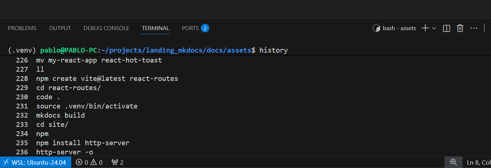

# 🧠 Cómo funciona

1. **Subí un archivo de audio** (o grabá directamente desde el navegador).  
2. El backend procesa el audio con **Whisper**, generando el texto.  
3. Podés **editar, revisar y exportar** la transcripción.  
4. Todo el proceso se ejecuta en infraestructura propia, sin depender de servicios externos.

  

