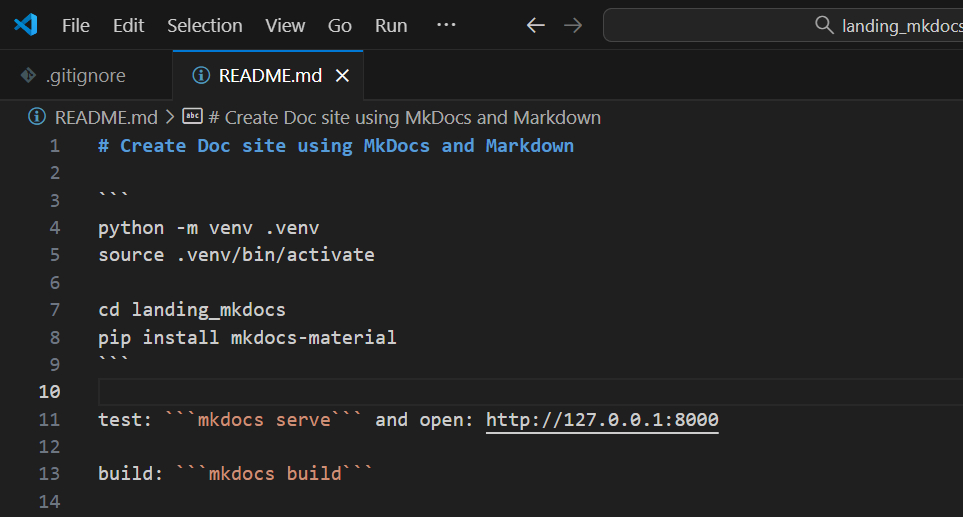

# 🎧 Transcriptor AI

> Un sistema moderno y rápido para generar transcripciones automáticas usando **Whisper**.

  <video width="700" controls>
    <source src="assets/demo.mp4" type="video/mp4">
    Tu navegador no soporta video HTML5.
  </video>

---

## 🚀 Principales ventajas

- 🎙️ Transcripciones precisas con **Whisper** de OpenAI.  
- ⚡ Interfaz moderna, **oscura y minimalista**.  
- 🧠 Corrección automática y detección de idioma.  
- 📂 Gestión completa de proyectos de transcripción.  
- 🔒 Totalmente privado, desplegado en tu propia infraestructura.

---

  

---

## ✨ Explora más

- [Características](features.md)  
- [Cómo funciona](how-it-works.md)  
- [Capturas de pantalla](screenshots.md)
